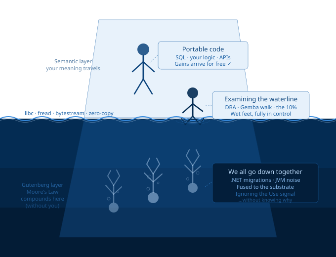

# rinie.github.io

A blog about software architecture, systems thinking, and the boundary between physical and logical layers.
Exploring being a Weak link willing to **learn** that is Listen to actual Use **feedback**.

Published at [rinie.github.io](https://rinie.github.io).

---

## The Framework Visualised



Left iceberg: Unix/Node.js with a clean boundary at `fread/libc` — the semantic top ~20% is portable and moves freely to any cloud zone. Right iceberg: Java/.NET where semantic noise permeates every layer and the whole stack must move together.

---

## The Series

Sixty-one posts, one coherent framework applied at every layer from printing presses to parking cars.

Posts are drip-fed one per day via GitHub Pages. If you cannot wait — the `_posts/` folder in this repo contains everything. No spoiler warnings. The series is a git repo, not a Netflix show. The external resolver is right there in the URL bar.

| # | Post | Date | Core idea |
|---|---|---|---|
| 1 | [The Gutenberg/Semantic Model](https://rinie.github.io/2026/05/14/gutenberg-vs-semantic/) | May 14 | The foundational framework |
| 2 | [Def-Use, Lean Pull, and Why the User Does Not Sux](https://rinie.github.io/2026/05/16/def-use-lean-pull/) | May 16 | The human feedback dimension |
| 3 | [MDI versus Tabs: Why Microsoft Kept Getting It Wrong](https://rinie.github.io/2026/05/17/mdi-versus-tabs/) | May 17 | Window management as tribal Def |
| 4 | [CarPlay, Nokia, and the Certification Tribe](https://rinie.github.io/2026/05/18/carplay-nokia-certification-tribe/) | May 18 | Certification as tribal weapon |
| 5 | [Sonos, Intel, and Apple: When the Tribe Breaks the Product](https://rinie.github.io/2026/05/19/sonos-intel-apple-tribe/) | May 19 | Gutenberg tribe claiming semantic layer |
| 6 | [The Linux Paradox: A Gutenberg Kernel and a Semantic Desktop](https://rinie.github.io/2026/05/20/linux-kernel-desktop-paradox/) | May 20 | Use oracle versus no oracle |
| 7 | [YAML, JSON, and the Config File That Fights Back](https://rinie.github.io/2026/05/21/yaml-json-config-formats/) | May 21 | O(1) boundary principle |
| 8 | [DuckDB: The Gutenberg/Semantic Model Done Right](https://rinie.github.io/2026/05/22/duckdb-gutenberg-semantic/) | May 22 | The model done right + dual-track strategy |
| 9 | [Exceptions, Result/Option, and HTTP: Error Handling as Def-Use](https://rinie.github.io/2026/05/23/exceptions-result-option-http/) | May 23 | Errors as values versus control flow hijacking |
| 10 | [Your Music Survived Six Formats. Why Did Your Bank Account Number Stay Behind?](https://rinie.github.io/2026/05/24/music-survived-six-formats/) | May 24 | Semantic identity versus Gutenberg carrier |
| 11 | [Your Email Address Is Hostage. It Does Not Have to Be.](https://rinie.github.io/2026/05/25/email-address-hostage/) | May 25 | Own your domain, make the carrier replaceable |
| 12 | [The Boundary Has a Lifecycle](https://rinie.github.io/2026/05/26/boundary-lifecycle/) | May 26 | From Unix portability to WebAssembly |
| 13 | [UUIDs Are Not Names](https://rinie.github.io/2026/05/27/uuids-are-not-names/) | May 27 | Gutenberg identifiers leaking into the semantic layer |
| 14 | [Why IPv6's Def-Push Failed: NAT Was Not a Hack](https://rinie.github.io/2026/05/28/why-ipv6-def-push-failed/) | May 28 | Chesterton's Fence and load-bearing boundaries |
| 15 | [Competition Is Use-Pull. Monopoly Is Def-Push. Government Is Both.](https://rinie.github.io/2026/05/29/competition-use-pull-monopoly-def-push/) | May 29 | Exit as the Use signal transmission mechanism |
| 16 | [Moore's Law as an Architectural Principle](https://rinie.github.io/2026/05/30/moores-law-architectural-principle/) | May 30 | Portability as a basket option on unknown future improvements |
| 17 | [The Compiler That Knew Where It Was](https://rinie.github.io/2026/05/31/compiler-snr-evolution/) | May 31 | SNR in IRs — why keeping `{}` structure is free information the flat CFG destroys |
| 18 | [Worse Is Better Because the Gap Is Where Evolution Happens](https://rinie.github.io/2026/06/01/worse-is-better-gap-evolution/) | Jun 1 | Gabriel was right about worse beating better, wrong about why |
| 19 | [Ten Users Saying It Sux Means It Sux](https://rinie.github.io/2026/06/02/ten-users-saying-it-sux/) | Jun 2 | 90/<10/<1 population scaling and the Def-Push distortion |
| 20 | [Your Lights Don't Know Your Name](https://rinie.github.io/2026/06/03/bluetooth-matter-rdf-naming/) | Jun 3 | Bluetooth, Matter, and RDF all push Gutenberg identifiers across the boundary |
| 21 | [The Postman Reads the Envelope, Not the Letter](https://rinie.github.io/2026/06/04/postman-reads-envelope/) | Jun 4 | Books, pages, and Gutenberg 2.1 for a general audience |
| 22 | [The Postman Reads the Envelope, Not the Letter: How Gutenberg 2.1 Bounds Complexity](https://rinie.github.io/2026/06/05/postman-does-not-read-letter/) | Jun 5 | DNS once, routing per page, libc as the waterline, Chrome and VS Code as flexible seams |
| 23 | [Working on the Same Page](https://rinie.github.io/2026/06/06/working-on-the-same-page/) | Jun 6 | Web craft boundaries — HTML, CSS, JS, HTTP as clean Def-Use seams |
| 24 | [Deprecation Considered Harmful](https://rinie.github.io/2026/06/07/deprecation-considered-harmful/) | Jun 7 | Old stars fade. You do not outlaw them. Python 3, UTF-16, and the 16-bit bet. |
| 25 | [Hiding the Waterline Makes You Drown Without Knowing Why](https://rinie.github.io/2026/06/08/hiding-the-waterline/) | Jun 8 | Legibility at the boundary is a feature, not a leak |
| 26 | [The Brick That Sticks Out: Why {} Beats Indentation](https://rinie.github.io/2026/06/09/brick-that-sticks-out/) | Jun 9 | Scanning for landmarks is O(1). Taking measurements is O(n). |
| 27 | [Revisiting the Waterline: Small Fixes, Five Years Later](https://rinie.github.io/2026/06/10/revisiting-the-waterline/) | Jun 10 | Platform drift, LTS cadence, and why you never deploy on Fridays |
| 28 | [After 25 Years SQL Still Wins](https://rinie.github.io/2026/06/11/sql-still-wins/) | Jun 11 | DBA tweaking queries after the architect left — and why SQL survives |
| 29 | [Famous Last Words: 640K, 65536, and the Ceiling You Are Drawing Right Now](https://rinie.github.io/2026/06/12/famous-last-words/) | Jun 12 | The arrogance of ceilings, Moore's Law, and the room that has walls |
| 30 | [Don't Go Down With Your Iceberg](https://rinie.github.io/2026/06/13/dont-go-down-with-your-iceberg/) | Jun 13 | The 10% is the steering budget. Accept it. |
| 31 | [31 Days, One Framework, One Conversation](https://rinie.github.io/2026/06/14/31-days-one-framework/) | Jun 14 | One-month reflection on the series and the workflow that produced it |
| 32 | [Gutenberg: Your Next Phone Will Be a Different Make on a Different Carrier. Your Number Is Still Yours.](https://rinie.github.io/2026/06/15/gutenberg-your-next-phone/) | Jun 15 | The external resolver as the mechanism of iceberg transitions |
| 33 | [The Complaint Department Has Been Transferred to Another Dimension](https://rinie.github.io/2026/06/16/complaint-department-transferred/) | Jun 16 | Enshittification — when the resolver becomes a toll booth |
| 34 | [Going to the Gemba: Getting Your Feet Wet at the Waterline](https://rinie.github.io/2026/06/17/going-to-the-gemba/) | Jun 17 | The sticky note is a bug report. Watch without helping. |
| 35 | [I Didn't See the Bore-Out Coming. Don't Ask Me to Park Cars.](https://rinie.github.io/2026/06/18/bore-out-dont-ask-me-to-park-cars/) | Jun 18 | Bore-out, Marvin, and the missing resolver between capability and task |
| 36 | [Every 'Where Is the Close Button?' Is a Bug](https://rinie.github.io/2026/06/19/where-is-the-close-button/) | Jun 19 | Krug's Don't Make Me Think as Use-Pull interface design |
| 37 | [Nothing Is Confusing to Me: The Inmates Are Running the Asylum](https://rinie.github.io/2026/06/20/nothing-is-confusing-to-me/) | Jun 20 | Proximity blindness, Dancing Bears, and the two Steves |
| 38 | [Muddy Water(line)s, Shady User Experience](https://rinie.github.io/2026/06/21/muddy-waterlines-sux/) | Jun 21 | Dark patterns, Chrome, and the browser that became the server spy |
| 39 | [Ambiguity Is Not a Bug: Trust, Provenance, and the Resolver That Cried Wolf](https://rinie.github.io/2026/06/22/ambiguity-is-not-a-bug/) | Jun 22 | WhatsApp fraud, npm hijacks, QR codes — hiding ambiguity is the bug |
| 40 | [Do You Trust This Document? No, I Have to Read It First.](https://rinie.github.io/2026/06/23/wasm-sandbox-vs-policy/) | Jun 23 | WASM sandboxes versus security policies — one is engineering, one is hope |
| 41 | [Hitchhiking to 42: What We Already Knew](https://rinie.github.io/2026/06/24/hitchhiking-to-42/) | Jun 24 | The rode draad, the O(1) boundary, the external resolver, and a reminder |
| 42 | [42: You Still Need a Towel at the Waterline](https://rinie.github.io/2026/06/25/42-towel-at-the-waterline/) | Jun 25 | The Answer is 42. The Question is still being computed. Remember: bring your towel. |
| 43 | [The Intuition Had a Shape](https://rinie.github.io/2026/06/26/the-intuition-had-a-shape/) | Jun 26 | Breadth-first all the way down — from TurboC to SSA to a flat token tape |
| 44 | [Cheap Moves Instead of Silver Bullet](https://rinie.github.io/2026/06/27/cheap-moves-instead-of-silver-bullet/) | Jun 27 | Brooks was right — but aimed at the wrong layer. The leverage is at the fast layer. |
| 45 | [Worse Ages Better Than Perfect](https://rinie.github.io/2026/06/28/worse-ages-better-than-perfect/) | Jun 28 | The perfectly designed thing is perfect for yesterday. Simplicity at the seam is portability through time. |
| 46 | [Buffer Overflow Is Printing Outside the Page](https://rinie.github.io/2026/06/29/buffer-overflow-is-printing-outside-the-page/) | Jun 29 | Gutenberg errors tear the page. Semantic errors stay on it. Rust keeps the channels separate. |
| 47 | [Marvin Remembers the Serial Number of Every Car. The Barrier Only Reads the Plate.](https://rinie.github.io/2026/06/30/marvin-remembers-serial-number/) | Jun 30 | Hide the serial number, expose the plate. The resolver maps them when needed. |
| 48 | [Breadth-First Is How You Find the Seams](https://rinie.github.io/2026/07/01/breadth-first-is-how-you-find-the-seams/) | Jul 1 | Breadth-first holds a layer flat and shows where the pace changes. That change is the seam. |
| 49 | [The Watershed: From Mac OS to iOS to Android, and the Linux Thread Running Through All of It](https://rinie.github.io/2026/07/02/the-watershed/) | Jul 2 | 1991→2001→2007→2024: commodity catching up, the Doom moment, DuckDB on Android |
| 50 | [You Actually Move Faster Without Breaking Things](https://rinie.github.io/2026/07/03/you-actually-move-faster/) | Jul 3 | Schmiel the painter, the 386 move, slow and smooth compounds, you know the next turn |
| 51 | [Penny Recognised Woz: The 90% Signal in Every Room](https://rinie.github.io/2026/07/04/penny-recognised-woz/) | Jul 4 | Zaphod, Sheldon, Woz — three feedback loops. Penny and Trillian know where the towel is. |
| 52 | [The Billy With Opinions: Linux, Ubuntu, and the Waterline That Keeps Moving](https://rinie.github.io/2026/07/05/billy-with-opinions/) | Jul 5 | Debian as the stable Billy, Ubuntu as rafting, Android/ChromeOS taking what works |
| 53 | [Frameworks Move the Seam: Even Trains Don't Demand a Wider Track](https://rinie.github.io/2026/07/06/frameworks-move-the-seam/) | Jul 6 | OOP, UTF-16, Brunel's gauge — infra changes are very expensive |
| 54 | [Every Night, Fixed Zero Days](https://rinie.github.io/2026/07/07/every-night-fixed-zero-days/) | Jul 7 | Potholes compound. Sinkholes get filled. Move on. Nothing broken. Most is well. |
| 55 | [If You Can't Diff It, It's a Dead End Street](https://rinie.github.io/2026/07/08/if-you-cant-diff-it/) | Jul 8 | git as the non-semantic index. The Universal Tree Fallacy (UTF). Plant new trees, do not move the forest. |
| 56 | [Stuck in the Middle: The JVM, CIL, and the Billy That Had to Read the Book](https://rinie.github.io/2026/07/09/stuck-in-the-middle/) | Jul 9 | Stack-based not register-based. Objects not values. The CD case Billy that refused Blu-ray. WASM got it right. |
| 57 | [Should I Click? Trusting the Letter by the Envelope](https://rinie.github.io/2026/07/10/should-i-click/) | Jul 10 | The opaque URL removed the envelope on purpose. Your hesitation is the system working correctly. |
| 58 | [The Streaming Billy Is Not That Far Away](https://rinie.github.io/2026/07/11/streaming-billy/) | Jul 11 | Gutenberg's press at light speed. URI is the VIN. URL is the plate. IP is the parking space. 10x cannot be predicted. |
| 59 | [Fixing the Seams Across the Waterline: Higher Dikes Are Not Always the Solution](https://rinie.github.io/2026/07/12/fixing-the-seams-across-the-waterline/) | Jul 12 | NL-Alert, the Ahr valley, and the seam between knowing and acting. Not smarter — earlier lessons learned. |
| 60 | [Embracing the Web Instead of Fighting It](https://rinie.github.io/2026/07/13/embracing-the-web/) | Jul 13 | XML fought the web and lost. Markdown, Node.js, TypeScript, Electron embraced it. The 10x cannot be led — only learned at the Gemba. |
| 61 | [Knowing Your Craft: Adding an Architect Slows Down, Adding a Bricklayer Speeds Up](https://rinie.github.io/2026/07/14/knowing-your-craft/) | Jul 14 | Craft-based shearing layers. The bikeshed is always a Semantic dispute. Linus only says no to waste. |
| 62 | [More Than 10% Waste? That Was a Leap of Faith.](https://rinie.github.io/2026/07/15/more-than-10-percent-waste/) | Jul 15 | Lean waste validates the architect. Build, Measure, Learn. Check validates both Do and Plan. The plan that learned. |
| 63 | [The Brick That Could Not Tell If It Was in the Living Room or the Kitchen](https://rinie.github.io/2026/07/16/brick-that-could-not-tell/) | Jul 16 | Mach, Hurd, DBus — the microkernel ignored the O(1) context switch cost. Plan 9 got the seam right. Android got the granularity right. |
| 64 | [WiFi, the Browser and the Router Just Evolve. Matter and MQTT Try to Fix the User.](https://rinie.github.io/2026/07/17/wifi-browser-router-evolve/) | Jul 17 | Ten router transitions, nothing broke. RFLink, Domoticz, Home Assistant — the boring seams won. Evolution will tell who suxed less. |
| 60 | [Embracing the Web Instead of Fighting It](https://rinie.github.io/2026/07/13/embracing-the-web/) | Jul 13 | XML fought the web and lost. Markdown, Node.js, TypeScript, Electron embraced it. The 10x cannot be led — only learned at the Gemba. |
| 61 | [Knowing Your Craft: Adding an Architect Slows Down, Adding a Bricklayer Speeds Up](https://rinie.github.io/2026/07/14/knowing-your-craft/) | Jul 14 | Craft-based shearing layers. The bikeshed is always a Semantic dispute. Linus only says no to waste. |

Posts publish one per day via Jekyll's scheduled publishing. GitHub Pages publishes each post automatically when its date arrives at midnight UTC (02:00 Netherlands time), triggered by a daily GitHub Actions workflow.

---

## The Core Framework

**The Gutenberg layer** is physical and positional — bytes, blocks, pages, frames, IP addresses, sector offsets. Position and size matter. The medium is part of the artifact.

**The Semantic layer** is logical and meaningful — characters, words, chapters, hostnames, messages, rows. Hierarchy and meaning matter. Content is independent of the medium.

The name comes from Gutenberg's printing press: a physical process that fixes semantic content (text) onto a physical artifact (a page) at a specific position (a folio). The page number is Gutenberg. The chapter title is Semantic.

**Gutenberg 2.0** — Unix, TCP/IP, virtual memory. The bytestream abstraction hides the physical medium. Everything is a file.

**Gutenberg 2.1** — bytestream + UTF-8 + git. Portability extended to text and to software itself. Clone a repo, run on any machine.

The best systems isolate the Gutenberg/Semantic boundary in one place — a parser, a codec, a DNS resolver — and keep it clean.

---

## About This Series

A plain-English map of the framework, written for readers arriving without the full series context: [/about/](https://rinie.github.io/about/)

---

## Stack

- [Jekyll](https://jekyllrb.com) with the Minima theme
- Hosted on [GitHub Pages](https://pages.github.com)
- Posts written in Markdown
- Daily publish via GitHub Actions (`.github/workflows/daily-publish.yml`)
- No build step required locally — GitHub builds on push

---

## Adding a Post

Create a file in `_posts/` named `YYYY-MM-DD-title.md` with front matter:

```markdown
---
layout: post
title: "Your Post Title"
date: YYYY-MM-DD
tags: [tag1, tag2]
level: general
description: "One or two sentence description for the index."
---

Post content here.
```

Push to `main`. GitHub Pages builds and publishes automatically. Future-dated posts publish at midnight UTC on their date without any further action.

---

## Assets

The iceberg diagram (`assets/img/gutenberg_semantic_iceberg.svg`) illustrates where you stand relative to the waterline. The house diagram (`assets/img/gutenberg_pace_layering_house.svg`) shows the full pace-layering model from hardware to human meaning. Both open in any browser or vector editor.
